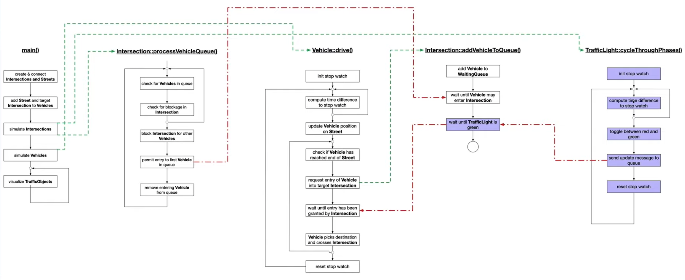

# Traffic System Simulation

A multithreaded traffic system simulator that models vehicles moving through ntersections controlled by traffic lights. Rendering is done with OpenCV and concurrency is implemented using modern C++ (threads, semaphores, futures).

## Program schematic

The following high-level diagram shows the components and how they interact:



- TrafficObject: common base for all simulated entities (ID, position, lifecycle threads)
- Intersection: queues vehicles and grants entry
- Street: connects two intersections
- Vehicle: drives along streets, queues at intersections
- Graphics: loads the background image and draws vehicles and traffic lights every frame

## Build and run instructions

### Dependencies

On Ubuntu/Debian-based system:
- C++20
- CMake 3.11+
- OpenCV 4 (core, imgproc, highgui)
- Boost Unit Test Framework (for tests)

### Build and run

From the root directory:

```bash
mkdir build && cd build
cmake .. && make
./main
```

### Run tests

The unit tests build alongside the app. You can run them directly:

```bash
./test/unit_tests
```